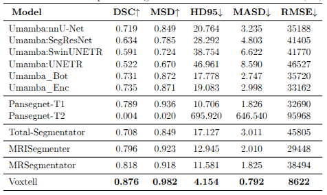

# PancreasMRISegmentation

Comprehensive benchmarking and inference toolkit for MRI segmentation models.

This repository provides a unified interface to run multiple model families on common pancreas MRI datasets, then evaluate and compare results.

It can also be adapted for any abdominal organ by setting the correct dataset_label and model label.

## What Is Included

- Unified inference wrapper for:
	- nnUNetv2-style models
	- uMamba variants
	- nnUNetv1/PanSegNet-style predictors
	- VoxTell predictor
- Benchmark orchestration from a YAML config
- Evaluation scripts for Dice/surface-based metrics and aggregate reporting
- Utilities for downloading pretrained weights

## Requirements

- Linux
- Python >= 3.12 and < 3.15
- CUDA GPU recommended for practical runtime

## Install

### Option A: PDM (recommended)

```bash
cd /home/derzhana/MEN1/PancreasMRISegmentation
pdm install
```

Install optional uMamba extras:

```bash
pdm add "PancreasMRISegmentation[umamba]"
```

### Option B: pip editable install

```bash
cd /home/derzhana/MEN1/PancreasMRISegmentation
python -m venv .venv
source .venv/bin/activate
pip install -U pip
pip install -e .
```

## Environment Variables

The code reads paths from .env:

```dotenv
MODEL_DIR=/absolute/path/to/model_weights
RESULTS_DIR=/absolute/path/to/results
```


## Expected Input Format

For nnUNet-compatible inference, put images in an input folder with channel suffixes, for example:

```text
imagesTs/
	case_001_0000.nii.gz
	case_002_0000.nii.gz
```

Output segmentations are written with the same case IDs.

## Download Pretrained Weights

Download one or more known model weights:

```bash
pdm run python -m pancreasmrisegmentation.utils.download_weights \
	--weights_dir src/pancreasmrisegmentation/.model_weights \
	--model mri_segmentator \
	--model pansegnet_t2
```

Download all predefined weights:

```bash
pdm run python -m pancreasmrisegmentation.utils.download_weights \
	--weights_dir src/pancreasmrisegmentation/.model_weights \
	--all
```

## Single-Model Inference

Console entry point:

```bash
pdm run inference \
	-i /path/to/imagesTs \
	-o /path/to/predictions \
	-m /path/to/model_folder \
	--predictor nnUNetv2 \
	-f 0 1 2 3 4 \
	--device cuda
```

Important notes:

- Use model folders that contain fold directories (for example fold_0 ... fold_4).
- Supported predictors include nnUNetv2, umamba, nnUNetv1, and voxtell.
- If needed, disable test-time augmentation with --disable_tta.

## Benchmark Multiple Models and Datasets

1. Edit benchmark config:

- File: src/pancreasmrisegmentation/benchmarking_config.yaml
- Define datasets.path and datasets.labels
- Define each model with predictor and label

2. Run benchmark:

```bash
pdm run benchmark --config src/pancreasmrisegmentation/benchmarking_config.yaml
```

The benchmark writes predictions under RESULTS_DIR/{model_name}/{dataset_name}.

## Evaluate Predictions

Evaluate one prediction folder against labels:

```bash
pdm run python -m pancreasmrisegmentation.evaluate \
	--pred_dir /path/to/predictions \
	--gt_dir /path/to/labels \
	--label 1 \
	--dataset_label 1 \
	--save_path /path/to/metrics.json
```

Evaluate all model/dataset pairs from the benchmark config:

```bash
pdm run python -m pancreasmrisegmentation.evaluate_benchmarking \
	--config src/pancreasmrisegmentation/benchmarking_config.yaml \
	--results_dir benchmarking_results
```

## Adjusting to Other Organs and Datasets

To use this pipeline for organs other than pancreas or for new datasets:

1. Prepare data in nnUNet-compatible format.
	- Input images should follow channel naming (for example case_001_0000.nii.gz).
	- Ground-truth masks must be aligned with the input images (same case IDs, spacing, and shape).

2. Update dataset entries in src/pancreasmrisegmentation/benchmarking_config.yaml.
	- Set datasets.<name>.path to your image folder.
	- Set datasets.<name>.labels to the corresponding label folder.
	- Set datasets.<name>.label to the label value used in that dataset for your target organ.

3. Update model entries in src/pancreasmrisegmentation/benchmarking_config.yaml.
	- Set models.<name>.predictor to the correct predictor backend (nnUNetv2, umamba, nnUNetv1, or voxtell).
	- Set models.<name>.label to the class value produced by that model for your target organ.

4. Run inference and evaluation.
	- For single-folder evaluation, use --label (model output label) and --dataset_label (ground-truth label).
	- For benchmarking evaluation, ensure model.label and dataset.label are set correctly in the config.

If labels are mismatched between predictions and ground truth, metrics will be misleading even if segmentations look visually correct.

## Testing Results on the Panther Dataset (92 Cases)
Data available: https://zenodo.org/records/15192302
